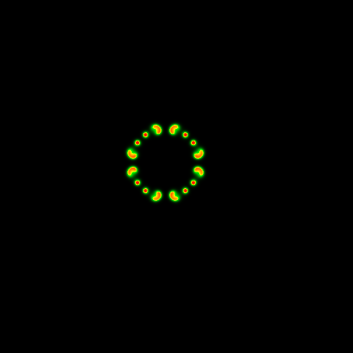
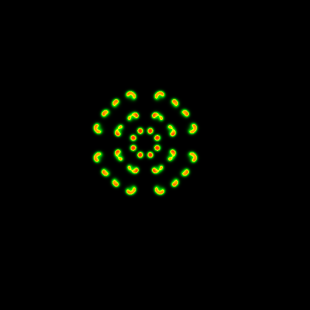

# Jour 2 — Optimisation d'un stencil (Gray-Scott)

*[Accueil](../README.md) · ← [Jour 1](day1.md)*

Le second jour applique les principes du Jour 1 à un cas concret : l'accélération
d'une simulation Gray-Scott à résultat constant.

---

## 1. Le modèle de Gray-Scott

Deux substances **U** et **V** diffusent dans l'espace et réagissent chimiquement. De
ce système émergent des **motifs de Turing**. Les équations gouvernantes :

```
∂u/∂t = Du·∇²u − u·v² + F·(1−u)
∂v/∂t = Dv·∇²v + u·v² − (F+k)·v
```

Le motif se développe au cours du temps :

<p align="center">
  
  
  
  <br/><em>Figure — Concentration de V aux stades initial, intermédiaire et final.</em>
</p>

---

## 2. Stencil et Laplacien

Le terme `∇²` (Laplacien) est évalué par un **stencil** : chaque point est mis à jour
en fonction de ses voisins.

```
        u[i-1,j]
u[i,j-1]  u[i,j]  u[i,j+1]      ∇²u ≈ (somme des voisins) − 4·u[i,j]
        u[i+1,j]
```

Cette opération constitue le noyau de calcul ; elle est typiquement memory-bound.

---

## 3. Mesure préalable

L'optimisation s'appuie sur la **mesure**, non sur l'intuition. La démarche consiste à
chronométrer l'exécution, identifier le point chaud (boucle dominant le temps de
calcul), puis n'optimiser que celui-ci (loi d'Amdahl).

```
écriture → MESURE → optimisation du point chaud → nouvelle mesure → …
```

---

## 4. Disposition mémoire (data layout)

Le noyau étant memory-bound, l'organisation des données en mémoire est déterminante.
La grille 2D est stockée dans **un tableau contigu** (et non un tableau de structures),
ce qui rend les accès réguliers et permet l'exploitation du cache et du SIMD.

**Principe :** des données contiguës maximisent l'efficacité mémoire.

---

## 5. Vectorisation automatique

Avec une disposition régulière et les options `-O3 -march=native`, le compilateur
vectorise le noyau de stencil. Le gain est significatif sans modification du code.

---

## 6. Progression d'optimisation (Ex 9 : `91 → 95`)

La même simulation est réécrite par étapes successives — cœur du Jour 2 :

| Version | Approche | Concept |
|---|---|---|
| `91` | très naïve (référence) | — |
| `92` | naïve | — |
| `93` | disposition efficace | memory-bound |
| `94` | auto-vectorisée | SIMD |
| `95` | Laplacien optimisé | — |

Le gain est mesuré à chaque étape, illustrant les principes du Jour 1.

---

## 7. Blocking (cache tiling)

Sur une grande grille, le volume de données parcouru dépasse la capacité du cache. Le
**blocking** découpe le calcul en **blocs** dimensionnés pour le cache, ce qui maximise
la réutilisation des données chargées.

```
Grille entière           Découpage en blocs
┌───────────────┐        ┌────┬────┬────┐
│               │   →    │ B1 │ B2 │ B3 │   chaque bloc tient
│               │        ├────┼────┼────┤   dans le cache
└───────────────┘        │ B4 │ B5 │ …  │
```

**Principe :** optimisation mémoire (et non calcul), pertinente en régime memory-bound.

---

## 8. Parallélisme avec TBB

**TBB** (Intel Threading Building Blocks) répartit le calcul sur l'ensemble des cœurs
(approche C++, comparable à OpenMP). Les lignes ou blocs de la grille sont distribués
entre les cœurs. Combinée à la vectorisation, la performance s'écrit : SIMD par cœur
× nombre de cœurs.

---

## 9. Sortie des données et visualisation (Ex 7-8)

- **Ex 7 — DataOutput** : enregistrement des résultats au format **HDF5** (standard
  d'E/S en HPC), accompagné d'un test de validation lecture/écriture.
- **Ex 8 — ImagePlotting** : conversion du fichier HDF5 en **images PNG**
  (post-traitement et visualisation).

```
simulation → output.h5 (HDF5) → gray_scott_image → pics/*.png
```

---

## 10. Analyse de performance (MAQAO)

**MAQAO** (UVSQ) analyse le **binaire au niveau assembleur** : identification des points
chauds, taux de vectorisation, régime (memory-bound / compute-bound) et recommandations
d'optimisation. Il établit le lien entre la correction fonctionnelle et la performance.

---

## Synthèse — hiérarchie d'optimisation

```
1. DATA LAYOUT          → accès mémoire réguliers
2. VECTORISATION        → calcul par paquets dans chaque cœur (SIMD)
3. BLOCKING             → maintien des données dans le cache
4. PARALLÉLISME (TBB)   → exploitation de tous les cœurs
5. GPU / multi-nœuds    → passage à l'échelle au-delà d'une machine
   ↳ mesure à chaque étape (MAQAO)
```

Reproduction de l'environnement : [guide d'installation](../INSTALL.md).
